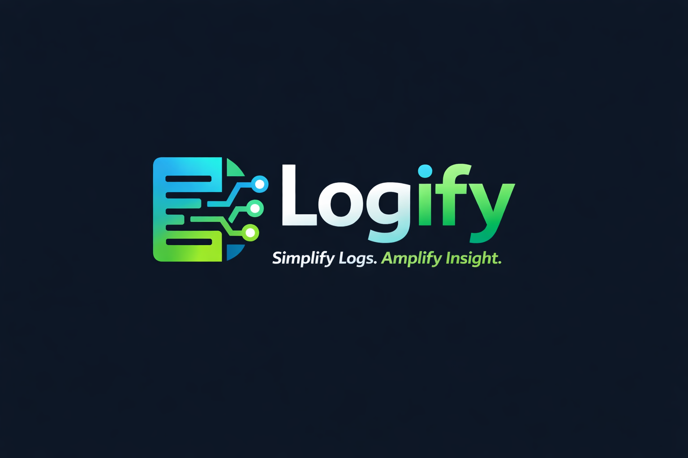

# LOGify - The Immersive Log Management System



## 1. Product Perspective

**LOGify** is a centralized on-prem or cloud platform acting as a single place for all logs. It includes agents/collectors, an ingestion pipeline, storage/indexing, search UI, dashboards, and alerting. It transforms mundane server logs into a real-time, holographic 3D experience, allowing admins to "feel" the pulse of their infrastructure.

---

## 2. Technology Stack (Full Detail)

| Component         | Technology                | Role & Responsibility                                                                                                             |
| :---------------- | :------------------------ | :-------------------------------------------------------------------------------------------------------------------------------- |
| **CLI Agent**     | **Python 3.10+**          | The "Pulse" running on the Client Server. Uses `watchdog` to listen for file events without polling. Uses `Rich` for terminal UI. |
| **Ingestion API** | **FastAPI (Python)**      | High-performance async API that creates the "Ingestion Pipeline". Validates API keys and sanitizes input.                         |
| **Realtime Bus**  | **WebSockets / Supabase** | The "Nervous System". Broadcasts log events from Backend to Frontend in <50ms.                                                    |
| **Storage**       | **PostgreSQL / SQLite**   | The "Memory". Production uses Supabase (PostgreSQL) for relational strength. Dev uses SQLite.                                     |
| **Frontend**      | **Next.js 14**            | The "Face". React-based App Router application. Handles routing and state.                                                        |
| **Visualization** | **Three.js / R3F**        | The "Hologram". Renders thousands of log particles in a 3D WebGL tunnel.                                                          |
| **Audio Engine**  | **Tone.js**               | The "Voice". Generates ambient soundscapes based on error density (Soni-Logs).                                                    |

---

## 3. Project Functions

### Core Functions

- **Smart Discovery**: Automatically scans OS (`/var/log`, `systemd`, `docker`) to find active logs without manual config.
- **Real-time Ingestion**: Captures logs the millisecond they are written to disk.
- **Holographic Streaming**: Visualizes logs as flying particles (Red=Error, Blue=Info).
- **Offline Buffering**: Caches logs locally if the internet cuts out.

### Advanced Functions

- **Soni-Logs**: Converts system health into audio metrics (Hum vs Static).
- **RBAC Enforcement**: Strict role separation between Admins and Auditors.
- **Auto-Fix Suggestions**: CLI provides copy-paste commands to fix broken logging configurations.

---

## 4. User Roles (RBAC)

| Role          | Access Level | Description                                                                        |
| :------------ | :----------- | :--------------------------------------------------------------------------------- |
| **Admin**     | Full Access  | Can generate API Keys, manage billing, delete projects, and invite team members.   |
| **Developer** | Read/Write   | Can push logs via CLI and debug issues using the Dashboard. Cannot delete history. |
| **Auditor**   | Read-Only    | Can view dashboards and generate compliance reports. No CLI interaction allowed.   |

---

## 5. Data Model

The system is built on a relational Schema:

- **Users**: Linked to Roles and Projects.
- **Projects**: Containers for Logs and API Keys.
- **Logs**:
  - `source`: File path or Service Name.
  - `level`: INFO, WARN, ERROR.
  - `message`: The raw text payload.
  - `meta`: JSON blob for extra context (IP, User-Agent).
  - `timestamp`: High-precision epoch time.

---

## 6. AI Features & Future Perspective

### Current AI Capabilities

- **Noise Cancellation**: The CLI uses basic frequency analysis to suppress repetitive log storms (e.g., 1000 "Connection Refused" events become 1 event with count=1000).

### Future Perspective: "Direct AI"

We are building towards a **Generative AI Log Analyst**:

- **Concept**: Instead of searching `level:ERROR`, you ask _"Why did the payment server crash at 2 AM?"_.
- **Mechanism**: An LLM (Large Language Model) vectorizes logs and correlates them across services to find causality.
- **Auto-Remediation**: The AI will suggested code fixes for the specific exceptions found in the logs.

---

## 7. Use Cases

### Scenario A: The "Silent Failure"

- **Problem**: A background worker fails silently. No errors in the UI, but jobs aren't processing.
- **LOGify Solution**: The **Audio Engine** detects the drop in "Success" logs. The ambient hum stops. The admin notices the silence immediately and investigates.

### Scenario B: The "DDoS Attack"

- **Problem**: Thousands of requests hit the server per second. Traditional text logs scroll too fast to read.
- **LOGify Solution**: The **3D Tunnel** shows a massive surge of particles. The velocity increases visually. The Admin sees the traffic pattern instantly as a "Visual Storm".

---

## 📂 Project Structure

```text
LOGify/
├── cli/             # Python Client Agent (The "Pulse")
│   ├── logify/      # Core logic (scan, tail, transport)
│   └── pyproject.toml
├── server/          # Backend API (The "Brain")
│   ├── main.py      # FastAPI entry point & WebSocket Manager
│   └── requirements.txt
├── web/             # Next.js Dashboard (The "Face")
│   ├── app/         # React pages & layouts
│   └── components/  # 3D Tunnel & UI components
└── docs/            # Design & Architecture Documents
```

## 🔄 Quick Start

### 1. Installation

The logic is now driven by the CLI. Install it (dev mode):

```bash
# From project root
pip install -e cli
```

### 2. Start the Backend & GUI

The CLI now manages the backend. This command starts the API Server:

```bash
# Recommended: Run via module
python3 -m logify.main gui
# OR if 'logify' is in your PATH
logify gui
```

_Note: Ensure the Web Frontend is running in a separate terminal: `cd web && npm run dev`_

### 3. Ingest Logs

The CLI pushes logs directly to the local database.
**Option A: Smart Scan**

```bash
python3 -m logify.main scan
```

**Option B: Live Tail**

```bash
# Watch a file and stream it to the DB in real-time
python3 -m logify.main tail /var/log/syslog
```

### 4. View Dashboard

Open [http://localhost:3000](http://localhost:3000) to see your logs in 3D.
