# 🏗️ System Architecture

LOGify follows a **Local-First, CLI-Driven** architecture designed for low latency and high data locality.

## 🔄 Data Flow Pipeline

1.  **Source**: The OS generates logs (Filesystem events).
2.  **Collection (CLI)**:
    - `scan`: Active Polling / Recursion.
    - `watch`: Passive Listening (Inotify).
3.  **Persistence (SQLite)**:
    - Data is immediately written to `Logs_DB/server.db` on disk.
    - No network overhead for ingestion; extremely fast write speeds.
4.  **Serving (FastAPI)**:
    - The Server reads from `Logs_DB/server.db`.
    - Exposes JSON endpoints for the Frontend.
5.  **Visualization (React)**:
    - Polls the Server every 1s.
    - Renders new entries as 3D particles.

```mermaid
graph LR
    LogFiles[📄 Log Files] -- Watchdog --> CLI[🕵️ CLI Agent]
    CLI -- Insert --> DB[(🗄️ Logs_DB)]
    Web[🖥️ Web Dashboard] -- HTTP GET --> Server[🧠 FastAPI]
    Server -- Select --> DB
```

## 🧩 Component Details

### 1. Classification Engine

Located in `cli/logify/scan.py`.
It uses a **Heuristic Keyword Matcher** to assign types:

- `*nginx*` -> Web Server
- `*auth*` -> Security
- `*syslog*` -> Kernel

### 2. Auto-Privilege Escalation

Located in `cli/logify/scan.py`.
If the agent encounters a `PermissionError` (e.g., typically `/var/log/auth.log`), it:

1.  Detects if it is not root (`os.geteuid() != 0`).
2.  Self-restarts using `subprocess.check_call(['sudo', ...])`.
3.  Preserves `PYTHONPATH` so the module imports don't break in the sudo environment.

### 3. Transparent Decompression

Located in `cli/logify/scan.py`.
The scanner automatically handles rotated logs (`app.log.1`, `error.log.2.gz`).

- It detects `.gz` extensions.
- Uses Python's `gzip` library to read the stream without extracting files to disk.
- Ensures historical data is captured without cluttering the filesystem.
