# LOGify API Architecture & Data Flow

This document details exactly how the pieces of LOGify talk to each other. It covers the journey of a single log line from your server's disk to the 3D dashboard in your browser.

## 🔗 The "Full Chart" (Visual Data Flow)

```mermaid
sequenceDiagram
    participant OS as 🖥️ Target OS
    participant CLI as 🐍 LOGify CLI
    participant API as 🧠 Backend API
    participant DB as 🗄️ Database (SQLite/Supabase)
    participant WS as 📡 WebSocket Bus
    participant WEB as 🌐 Web Dashboard
    participant 3D as 🧊 Three.js Engine

    Note over OS, CLI: Phase 1: Ingestion
    OS->>CLI: File Modified Event (Watchdog)
    CLI->>CLI: Read new line
    CLI->>CLI: Parse & Format JSON
    CLI->>API: HTTP POST /logs (Batch)

    Note over API, DB: Phase 2: Processing
    API->>API: Validate API Key
    par Persistence
        API->>DB: INSERT into logs table
    and Realtime
        API->>WS: Broadcast Log Event
    end

    Note over WS, 3D: Phase 3: Visualization
    WS->>WEB: Receive JSON Event
    WEB->>3D: Spawn Particle()
    3D-->>WEB: Animate Frame
```



## 🛠️ Component Connections

### 1. CLI ↔️ Backend (`HTTP/1.1`)
-   **Protocol**: REST (HTTP POST)
-   **Endpoint**: `http://server:8000/logs`
-   **Payload**:
    ```json
    [
      {
        "source": "/var/log/nginx/access.log",
        "level": "INFO",
        "message": "GET /api/v1/users 200",
        "timestamp": 1706263200.123,
        "meta": {"host": "web-01"}
      }
    ]
    ```
-   **Why HTTP?**: It's stateless and robust. If the connection drops, the CLI can just retry sending the batch later (Offline Buffering).

### 2. Backend ↔️ Database (`SQL`)
-   **Protocol**: SQL (Python `sqlite3` or `supabase-py`).
-   **Action**: synchronous (SQLite) or Asynchronous (Supabase) Insert.
-   **Schema**:
    -   `source`: Which file did this come from?
    -   `level`: Severity (affects color in UI).
    -   `message`: The actual log text.

### 3. Backend ↔️ Frontend (`WebSocket`)
-   **Protocol**: WebSocket (`ws://`)
-   **Endpoint**: `/ws`
-   **Behavior**:
    -   The Frontend connects once on load.
    -   The Backend keeps a list of `active_connections`.
    -   When a log arrives via HTTP, the Backend loops through active connections and calls `send_json()`.

### 4. Frontend ↔️ User (`See & Hear`)
-   **Three.js**:
    -   Parses the incoming JSON.
    -   Instantiates a geometry (Particle).
    -   Assigns color based on `level` (Error=Red).
-   **Tone.js**:
    -   Calculates `Error Count / Minute`.
    -   Adjusts the playback rate of the ambient drone sound.
