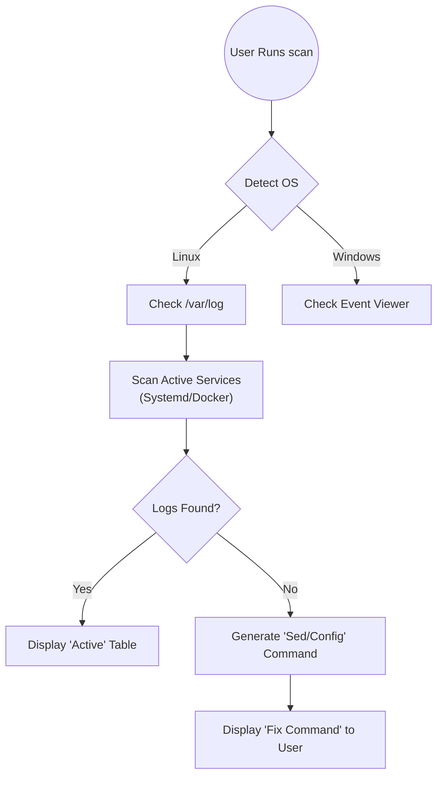
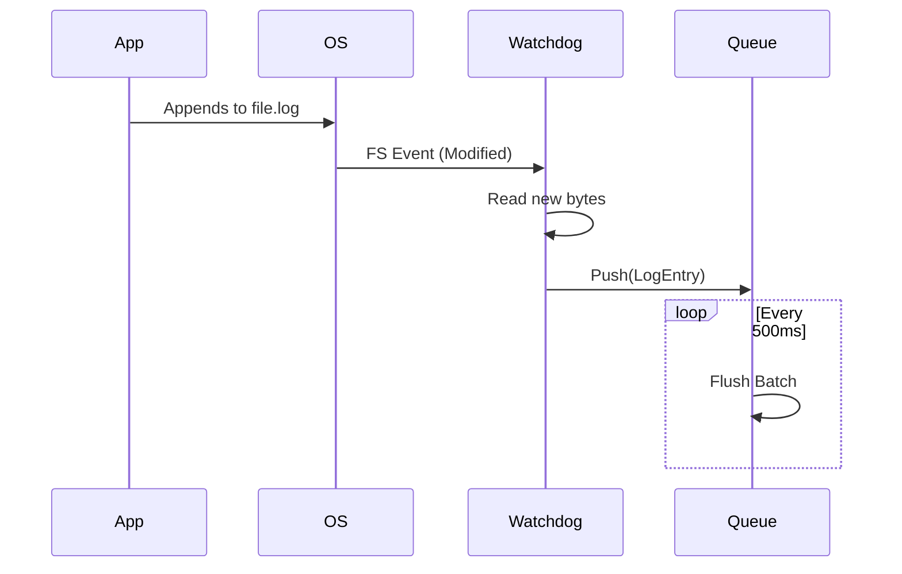
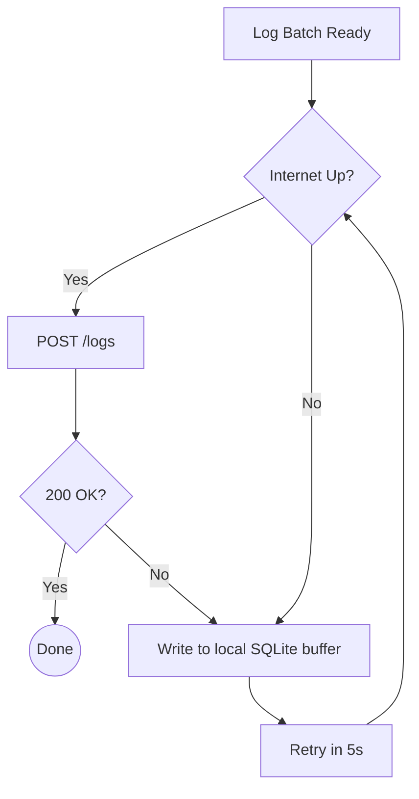
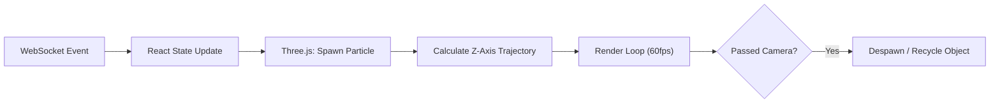
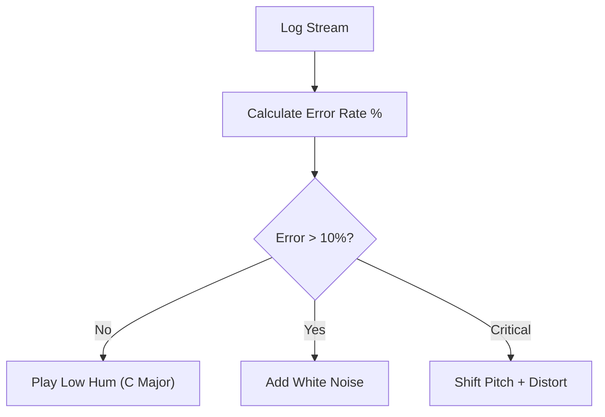
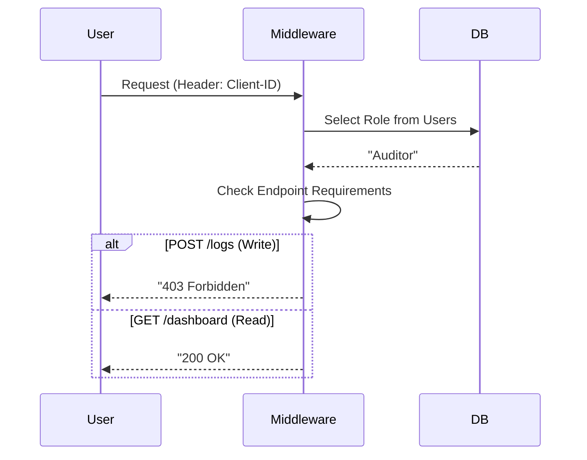
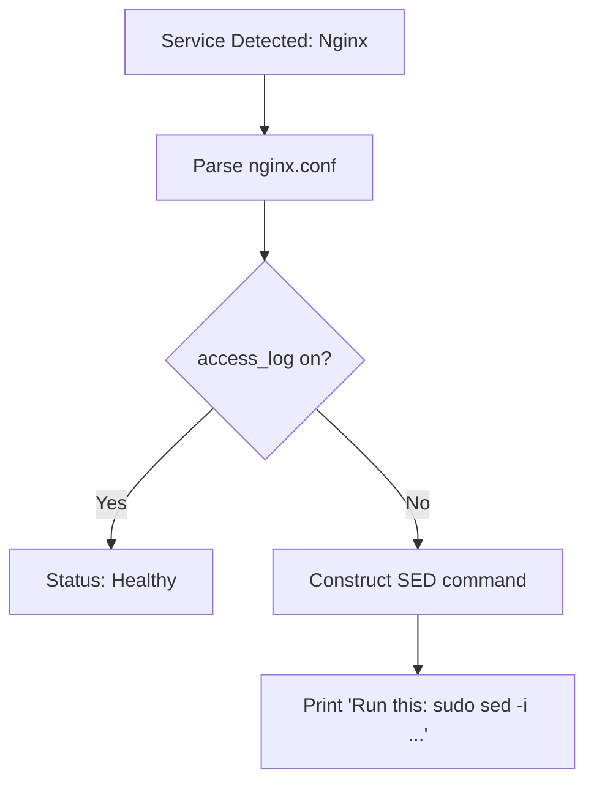
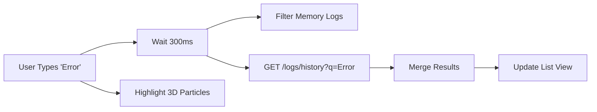
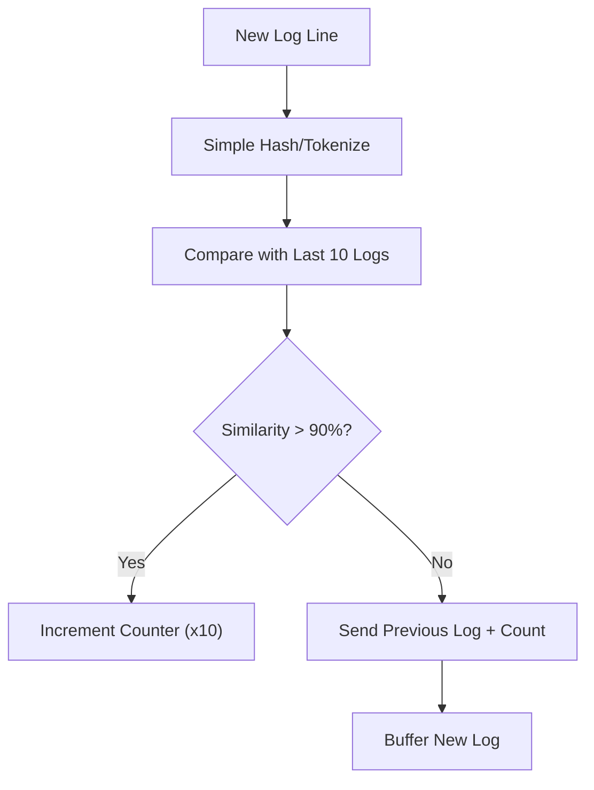

# LOGify Feature Workflows

This document visualizes the logic flow for the **9 Core Features** of LOGify.

## 1. Smart Discovery (CLI)
**Goal**: Automatically find logs and suggest fixes.

## 2. Real-time Ingestion (CLI)
**Goal**: Capture logs instantly without polling.

## 3. Offline Buffering (Resilience)
**Goal**: Never lose a log if the internet dies.

## 4. holographic Streaming (3D Frontend)
**Goal**: Visualize data velocity.

## 5. Soni-Logs (Audio Engine)
**Goal**: Hear server health.

## 6. RBAC Enforcement (Backend)
**Goal**: Secure access control.

## 7. Auto-Fix Suggestions (CLI)
**Goal**: Help user fix broken logging.

## 8. Search & Filter (Frontend)
**Goal**: Find needles in the haystack.

## 9. AI Noise Cancellation
**Goal**: Compress repetitive data.

