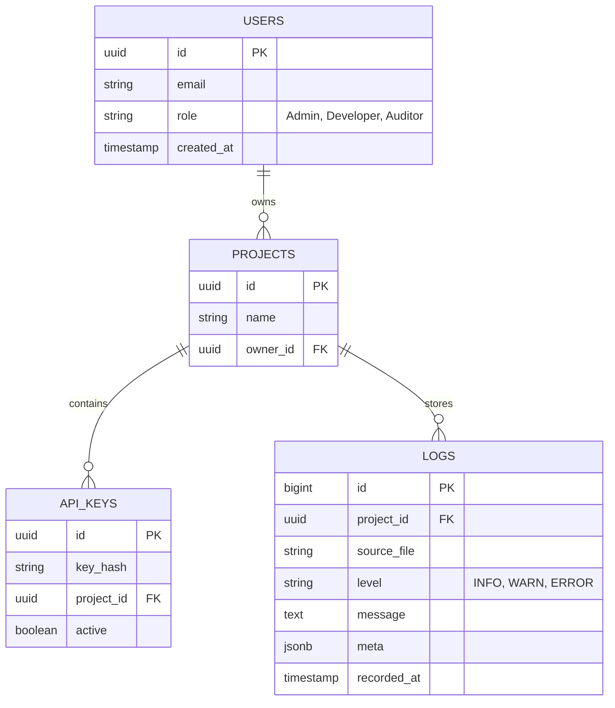

# Software Requirements Specification (SRS)
**Project Name:** LOGify  
**Version:** 1.0.0  
**Date:** 2026-01-26  
**Authors:** LOGify Team (Antigravity)

---

## 1. Introduction

### 1.1 Purpose
The purpose of this document is to define the requirements for **LOGify**, a next-generation log management system. This platform aims to modernize server monitoring by providing a high-fidelity, immersive 3D and auditory experience for system administrators, replacing traditional list-based views with a "living" data stream.

### 1.2 Scope
LOGify is a distributed system consisting of:
1.  **LOGify CLI Agent**: A lightweight Python client running on target servers (Linux/Windows) to discover, ingest, and push logs.
2.  **LOGify Backend**: A centralized API server and database layer for data processing and storage.
3.  **LOGify Dashboard**: A Next.js-based web interface for real-time 3D visualization, audio feedback, and analytical search.

The system focuses on real-time ingestion, intelligent noise cancellation, and "holographic" data representation.

### 1.3 Definitions, Acronyms, and Abbreviations
- **CLI**: Command Line Interface.
- **SRS**: Software Requirements Specification.
- **Soni-Logs**: The feature converting log patterns into ambient audio.
- **Smart Scan**: The CLI feature that auto-detects system services and log configurations.

---

## 2. Overall Description

### 2.1 Product Perspective
LOGify operates as a hybrid solution. The **Agent** sits on the user's infrastructure (Client-side), while the **Server/Dashboard** can be hosted on-premise or in the cloud. It interfaces with the Operating System's file system (Linux/Windows) and standard logging streams.

### 2.2 Product Functions
- **Automated Discovery**: Detects running services (e.g., Nginx, Docker) and identifies if their logging is disabled.
- **Real-time Streaming**: Pushes logs from disk to the web dashboard with millisecond latency.
- **3D Visualization**: Renders logs as particles in a 3D tunnel, where velocity represents throughput and color represents severity.
- **Audio Monitoring**: Generates generative ambient soundscapes reflecting system health.
- **Persistent Storage**: archives logs for historical analysis.

### 2.3 Operating Environment
- **Client (Agent)**:
    - Linux (Ubuntu, Debian, Arch, CentOS).
    - Windows Server 2019+.
    - Python 3.10 Runtime.
- **Server**:
    - Node.js / Python environment.
    - PostgreSQL Database (via Supabase).
- **Client (User)**:
    - Modern Web Browser (Chrome/Firefox) with WebGL support.

---

## 3. System Features & Functional Requirements

### 3.1 CLI Agent Features
#### 3.1.1 Smart Log Discovery
- **Description**: The CLI shall automatically scan standard directories (`/var/log`, `C:\Windows\System32\winevt\Logs`) and running processes.
- **Requirement**: If a service (e.g., Nginx) is active but logs are missing, the CLI MUST provide the exact shell command to enable them.
- **Input**: `logify scan` command.
- **Output**: Table of detected services, log paths, and health status.

#### 3.1.2 Real-time Ingestion
- **Description**: The CLI shall monitor file system events using `watchdog` to detect new lines instantly.
- **Requirement**: The agent must not rely on polling (sleeping) for efficiency.
- **Requirement**: Determine log level (INFO/WARN/ERROR) before sending.

#### 3.1.3 Offset Management & Offline Buffering
- **Description**: The agent must handle network interruptions.
- **Requirement**: If the server is unreachable, logs must be buffered to a local SQLite file.
- **Requirement**: Upon reconnection, buffered logs must be flushed to the server.

### 3.2 Backend Services
#### 3.2.1 Ingestion API
- **Technology**: Python (FastAPI).
- **Requirement**: Endpoint `POST /api/ingest` must accept batch JSON log entries.
- **Requirement**: Must validate API Keys for security.

#### 3.2.2 Live Broadcasting
- **Technology**: Supabase Realtime / WebSockets.
- **Requirement**: New DB inserts must be broadcast to connected Frontend clients immediately.

### 3.3 Web Dashboard
#### 3.3.1 3D Holographic View
- **Technology**: Three.js / React Three Fiber.
- **Requirement**: Render a "Tunnel" effect.
- **Requirement**: Red particles = Error, Yellow = Warn, Blue = Info.
- **Requirement**: Particle speed must correlate to `Logs/Second`.

#### 3.3.2 Soni-Logs (Audio)
- **Technology**: Tone.js.
- **Requirement**: Base drone sound for "system on".
- **Requirement**: Modulate pitch/distortion based on Error Rate.

#### 3.3.3 Search & Filter
- **Requirement**: Users must be able to filter by Service, Level, or Keyword.

---

## 4. System Data & Database Design

### 4.1 Schema Overview (ER Diagram)
The system uses a relational model (PostgreSQL) managed by Supabase.

### 4.2 Data Retention
- **Hot Storage**: Last 7 days pending in high-speed storage.
- **Cold Archival**: Logs older than 30 days are moved to S3/Blob storage (Future Scope).

---

## 5. System Phases of Operation

The LOGify system operates in **4 Distinct Phases**:

### Phase 1: Discovery (The "Smart Scan")
- **Actor**: CLI Agent.
- **Action**: Scans OS for active services (systemd, docker) and standard log paths.
- **Outcome**: A map of "Active Log Sources" is created.
- **User Interaction**: User confirms which logs to watch.

### Phase 2: Ingestion (The "Pipeline")
- **Actor**: CLI Agent (Tail Module).
- **Action**: 
    1.  **Watch**: OS File System Events trigger on new writes.
    2.  **Buffer**: Logs are pushed to a local Queue.
    3.  **Transport**: Queue is flushed via HTTP/WebSocket to Server.
- **Resilience**: If Server is down, Queue dumps to local SQLite.

### Phase 3: Processing & Storage (The "Brain")
- **Actor**: Backend API.
- **Action**:
    1.  **Validate**: Check API Key.
    2.  **Enrich**: Add Server IP / Geo-location.
    3.  **Broadcaster**: Push to Realtime Channel.
    4.  **Persister**: Async insert into Supabase DB.

### Phase 4: Visualization (The "Experience")
- **Actor**: Web Dashboard.
- **Action**:
    1.  **Receive**: WebSocket event triggers react hook.
    2.  **Render**: Three.js instanced mesh creates a new particle.
    3.  **Synthesize**: Audio engine modulates frequency based on error density.

---

## 6. External Interface Requirements

### 6.1 User Interfaces
- **CLI**: Rich text using the `rich` library (colors, spinners, tables).
- **Web**: Cyberpunk-themed aesthetic, Dark Mode default.

### 6.2 Software Interfaces
- **Supabase**: Used for Auth, Database (PostgreSQL), and Realtime subscriptions.
- **OS APIs**: `syslog` (Linux), `EvtQuery` (Windows).

---

## 7. Non-functional Requirements

### 7.1 Performance
- **Latency**: End-to-end latency (File write -> Dashboard visual) should be < 500ms.
- **Capacity**: The dashboard must render 1000+ particles at 60 FPS.

### 7.2 Reliability
- The CLI agent must auto-restart on crash (if installed as systemd service).
- No data loss during network partition (guaranteed via local buffering).

### 7.3 User Roles & Permissions (RBAC)
The system shall enforce Role-Based Access Control using Supabase Auth.

| Role | Permissions |
| :--- | :--- |
| **Admin** | **Full Access**: Create/Delete Projects, Generate API Keys, Manage Users, Configure Billing. |
| **Developer** | **Write/Read**: Can push logs (via CLI), View Dashboards. Cannot delete logs or manage team. |
| **Auditor** | **Read-Only**: Can only view dashboards and historical reports. No CLI access. |

### 7.4 Security
- All log data in transit must be encrypted (TLS).
- CLI agents must be authenticated via API Tokens.

---

## 8. AI Features & Future Perspective

### 8.1 Current AI Capabilities
- **Noise Cancellation**: The CLI uses basic frequency analysis to suppress repetitive log storms (e.g., 1000 "Connection Refused" events become 1 event with count=1000).

### 8.2 Future Perspective: "Direct AI"
We are building towards a **Generative AI Log Analyst**:
- **Concept**: Instead of searching `level:ERROR`, you ask *"Why did the payment server crash at 2 AM?"*.
- **Mechanism**: An LLM (Large Language Model) vectorizes logs and correlates them across services to find causality.
- **Auto-Remediation**: The AI will suggested code fixes for the specific exceptions found in the logs.

---

## 9. Use Cases

### 9.1 Scenario A: The "Silent Failure"
*   **Problem**: A background worker fails silently. No errors in the UI, but jobs aren't processing.
*   **LOGify Solution**: The **Audio Engine** detects the drop in "Success" logs. The ambient hum stops. The admin notices the silence immediately and investigates.

### 9.2 Scenario B: The "DDoS Attack"
*   **Problem**: Thousands of requests hit the server per second. Traditional text logs scroll too fast to read.
*   **LOGify Solution**: The **3D Tunnel** shows a massive surge of particles. The velocity increases visually. The Admin sees the traffic pattern instantly as a "Visual Storm".

